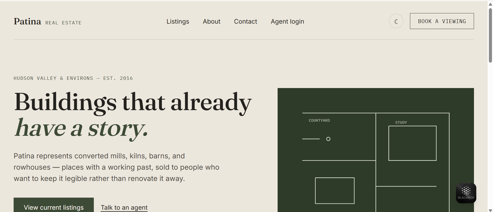
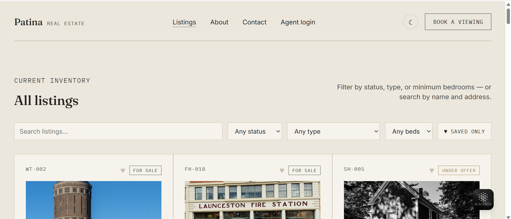
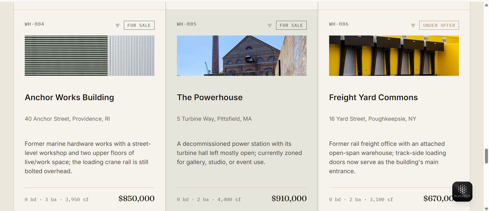
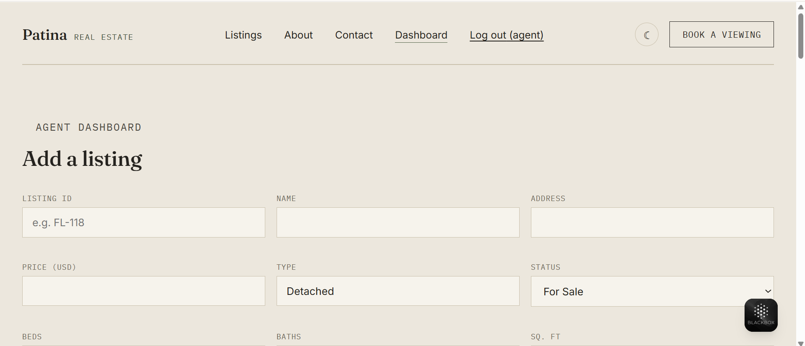

# Patina — Real Estate

A full-stack real-estate site concept for buildings with a working past —
converted mills, kilns, barns, and rowhouses. A Python (Flask + SQLite) API
backs a multi-page React (Vite) frontend with agent authentication, search,
favorites, and dark mode.


## Screenshots

| Home | Listings |
|---|---|
|  |  |

| Listing detail | Agent dashboard |
|---|---|
|  |  |

*(Add your own screenshots to `docs/screenshots/` — see
[docs/screenshots/README.md](docs/screenshots/README.md) for exactly what to
capture. GitHub will render them here automatically once the files exist.)*

## Stack

- **Backend:** Python 3, Flask, SQLAlchemy (SQLite), Flask-JWT-Extended,
  Flask-CORS. Split into models, blueprints, and a seed script.
- **Frontend:** React 18 + Vite + React Router, plain CSS with a small
  custom design-token system (no UI framework). All property diagrams are
  hand-drawn inline SVG — no stock photography, so there's nothing to license
  unless an agent uploads real photos.
- **Testing:** Pytest (backend), Vitest + Testing Library (frontend).
- **CI:** GitHub Actions runs both suites and the frontend build on every push.

## Features

- 🏠 **Listings API** with search and filtering (`status`, `type`, price
  range, minimum beds) backed by a real SQLite database, not mock data.
- 🔐 **Agent authentication** (JWT) protecting create/edit/delete and an
  inquiries inbox.
- 🖼️ **Photo upload** per listing — swaps the default blueprint diagram for
  a real image once an agent uploads one.
- 🔎 **Multi-page frontend**: Home, all Listings (with filters), a full
  Listing Detail page, About, Agents (team directory), FAQ, Privacy Policy,
  Terms of Service, agent Login, a protected Dashboard, a general Contact
  page, and a 404 — with a footer sitemap linking all of them.
- ⭐ **Favorites** saved to `localStorage`, with a "saved only" filter.
- 🌗 **Dark mode** toggle, persisted across visits.
- 🔔 **Toast notifications** for inquiry/dashboard actions, plus loading
  skeletons instead of bare "Loading…" text.
- ✅ **12 backend tests + 6 frontend tests**, run automatically in CI.

## Project structure

```
patina-real-estate/
├── .github/workflows/ci.yml    # pytest + vitest + build, on every push
├── docs/screenshots/            # add your own screenshots here (see its README)
├── backend/
│   ├── app.py                  # Flask app factory, blueprint registration
│   ├── extensions.py           # shared db / jwt instances
│   ├── models.py               # Listing, Agent, Inquiry
│   ├── routes/
│   │   ├── listings.py         # search/filter, CRUD, image upload
│   │   ├── inquiries.py        # public submit, protected inbox
│   │   └── auth.py             # login, current-agent lookup
│   ├── seed.py                 # creates DB + demo listings + demo agent
│   ├── tests/test_api.py
│   ├── uploads/                # listing photos land here
│   └── requirements.txt
└── frontend/
    ├── index.html
    ├── package.json
    ├── vite.config.js          # proxies /api and /uploads -> Flask on :5000
    └── src/
        ├── main.jsx             # router + all context providers
        ├── App.jsx              # nav, routes, footer
        ├── pages/                Home, Listings, ListingDetail, About,
        │                         Agents, FAQ, Privacy, Terms, Login,
        │                         Dashboard, Contact, NotFound
        ├── components/           Nav, Footer, ListingCard, ListingDiagram,
        │                         Skeleton, ProtectedRoute
        ├── context/              AuthContext, FavoritesContext,
        │                         ThemeContext, ToastContext
        ├── lib/api.js            fetch wrapper with JWT auth header
        └── tests/                App.test.jsx, ListingCard.test.jsx
```

## Running locally

**1. Start the API**

```bash
cd backend
pip install -r requirements.txt
python seed.py          # creates patina.db with demo listings + agent account
python app.py            # runs on http://localhost:5000
```

**2. Start the frontend**

```bash
cd frontend
npm install
npm run dev               # runs on http://localhost:5173, proxies /api to Flask
```

Open `http://localhost:5173`. (`VITE_API_URL` is only needed once frontend
and backend are deployed to different domains — see Deploying below. Leave
it unset for local dev; Vite's proxy handles it.)

**Demo agent login:** username `agent`, password `patina2026` (set in `seed.py`
— change or remove before deploying anywhere real).

## Running tests

```bash
# backend
cd backend && pytest tests/ -v

# frontend
cd frontend && npm run test
```

Both run automatically via GitHub Actions on every push to `main`
(`.github/workflows/ci.yml`).

## API reference

| Method | Route                        | Auth   | Description                          |
|--------|-------------------------------|--------|----------------------------------------|
| GET    | `/api/listings`               | —      | List/search listings. Query params: `status`, `type`, `min_price`, `max_price`, `min_beds`, `search`. |
| GET    | `/api/listings/<id>`          | —      | Single listing.                        |
| POST   | `/api/listings`                | Agent  | Create a listing.                      |
| PUT    | `/api/listings/<id>`          | Agent  | Update a listing.                      |
| DELETE | `/api/listings/<id>`          | Agent  | Delete a listing.                      |
| POST   | `/api/listings/<id>/image`    | Agent  | Upload a listing photo (`multipart/form-data`, field `image`). |
| POST   | `/api/inquiries`               | —      | Submit `{ name, email, message, listing_id? }`. |
| GET    | `/api/inquiries`               | Agent  | View submitted inquiries.              |
| POST   | `/api/auth/login`              | —      | `{ username, password }` → JWT.        |
| GET    | `/api/auth/me`                 | Agent  | Current agent profile.                 |
| GET    | `/api/health`                  | —      | Liveness check.                        |

## Design notes

- **Palette:** warm plaster background, ink charcoal text, moss-green and
  brass accents — reads as architectural/material rather than "corporate
  realty blue." Dark mode swaps tokens; the blueprint hero plate stays a
  fixed dark green regardless of theme, since it's meant to look like a
  physical drawing, not a themed UI element.
- **Type:** Fraunces (display), Inter (body), IBM Plex Mono (labels, stats,
  listing IDs) — the mono face nods to blueprint annotation.
- **Signature element:** an animated line-drawn floor plan in the hero that
  draws itself in on load, echoed by small procedural floor-plan glyphs on
  each listing card (swapped for a real photo once one is uploaded).

## Adding real listing photos

Every listing shows its blueprint-style SVG diagram until an agent uploads
a real photo — either through the Dashboard's per-listing "Upload" button,
or in bulk using the included script, which pulls real, properly-licensed
photos from the free **Pexels API**.

Why Pexels and not just grabbing images off Google: photos on the open web
belong to whoever took them, and reusing them without a license is a real
legal risk if you publish this project. Pexels photos are free for
commercial and personal use with no attribution required
([license](https://www.pexels.com/license/)) — safe to actually ship.

**1. Get a free API key** — go to
[pexels.com/api](https://www.pexels.com/api/), sign up, and copy your key.
No credit card, approval is instant.

**2. Set the key**, either as an environment variable:

```bash
export PEXELS_API_KEY=your_key_here
```

or in a `backend/.env` file:

```
PEXELS_API_KEY=your_key_here
```

**3. Run the script:**

```bash
cd backend
python fetch_photos.py
```

This downloads one photo per listing into `backend/uploads/` — with a
search term hand-matched to each property's style (a converted kiln, a
barn, a mid-century semi, and so on) — and updates each listing's
`image_url` in the database. Nothing on the frontend needs to change: it
already prefers a listing's photo over its default diagram once one exists.

Re-run the script any time to refresh the photos with new results.

## Deploying (Vercel + Render + Neon)

This is a three-piece deploy: **Neon** hosts the Postgres database, **Render**
hosts the Flask API, and **Vercel** hosts the React frontend. All three have
free tiers.

### 1. Database — Neon

1. Sign up at [neon.tech](https://neon.tech) and create a new project.
2. Copy the connection string it gives you (starts with `postgres://` or
   `postgresql://`) — you'll need it in step 2.

### 2. Backend — Render

1. Push this repo to GitHub first (see below), then sign up at
   [render.com](https://render.com) and choose **New → Web Service**,
   connecting your GitHub repo.
2. Set:
   - **Root directory:** `backend`
   - **Build command:** `pip install -r requirements.txt`
   - **Start command:** `gunicorn app:app` (matches the included `Procfile`)
3. Add environment variables under the service's **Environment** tab:
   - `DATABASE_URL` — paste your Neon connection string
   - `JWT_SECRET_KEY` — any long random string
   - `CORS_ORIGINS` — your Vercel URL once you have it (step 3), e.g.
     `https://patina.vercel.app` — you can leave this unset at first and
     add it after deploying the frontend
4. Deploy. Once it's live, open a shell for the service (Render provides
   one) and run `python seed.py` once to create the tables and demo data
   in your Neon database. Optionally also run `python fetch_photos.py`
   with a `PEXELS_API_KEY` env var set.
5. Note your Render URL, e.g. `https://patina-api.onrender.com`.

> **Uploads caveat:** Render's free tier disk isn't permanent storage —
> uploaded photos can be lost on redeploy. Fine for a demo; for real
> production use, swap `backend/routes/listings.py`'s local file save for
> an object store like S3 or Cloudflare R2.

### 3. Frontend — Vercel

1. Sign up at [vercel.com](https://vercel.com), **Add New → Project**, and
   import the same GitHub repo.
2. Set **Root Directory** to `frontend` (important — this is a monorepo).
   Vercel auto-detects the Vite framework preset.
3. Add an environment variable: `VITE_API_URL` = your Render URL from step 2
   (no trailing slash), e.g. `https://patina-api.onrender.com`.
4. Deploy. Once live, copy your Vercel URL and set it as `CORS_ORIGINS` on
   the Render backend (step 2.3) so the API accepts requests from it, then
   redeploy the backend.

### Pushing to GitHub first

```bash
git init
git add .
git commit -m "Initial commit"
git branch -M main
git remote add origin https://github.com/YOUR_USERNAME/patina-real-estate.git
git push -u origin main
```

`.gitignore` already excludes `node_modules/`, `dist/`, `patina.db`,
`backend/uploads/*` (except `.gitkeep`), and any `.env` files — your Pexels
key and JWT secret won't end up in the repo as long as you only ever put
them in `.env`, never `.env.example`.

## Next steps if you extend this

- Replace the hardcoded demo agent with a real signup/invite flow.
- Add pagination to `/api/listings` once the dataset grows.
- Add a stylized SVG map view alongside the list/grid view.
- Rate-limit the public inquiry endpoint.
